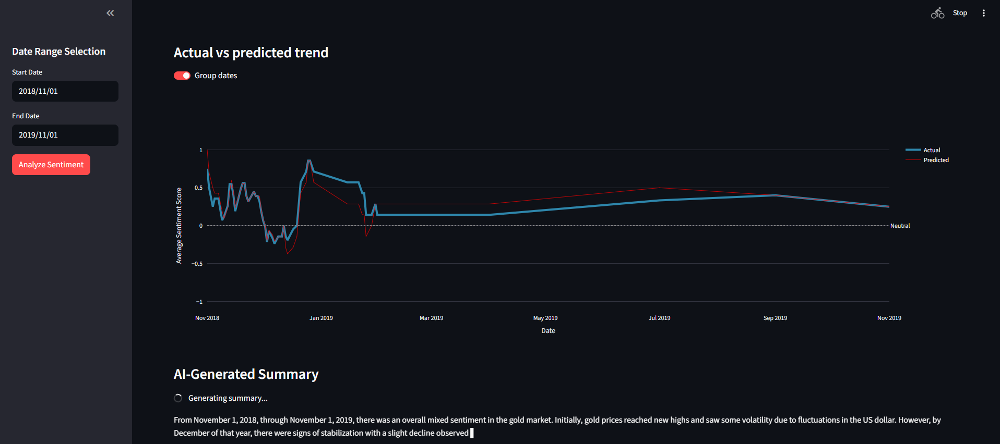
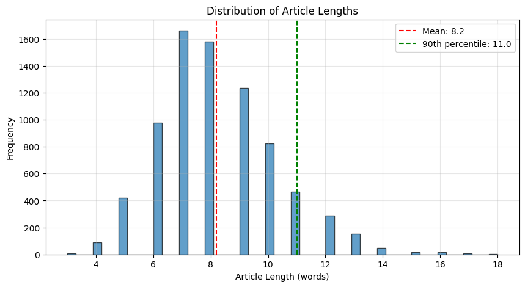
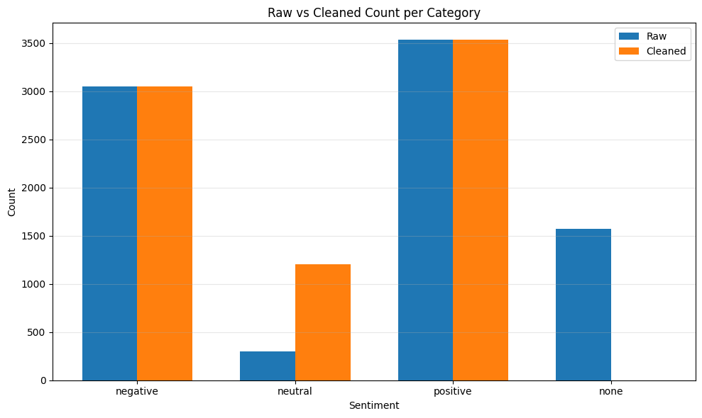
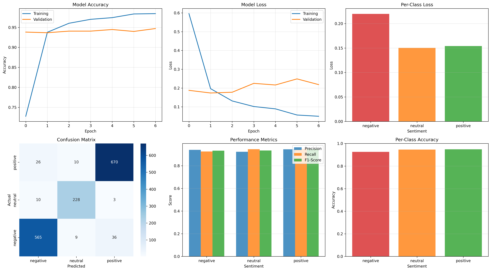

# Gold Market Sentiment Analyzer

A machine learning powered application that analyzes gold market sentiment from news headlines using an LSTM neural network. The app provides real-time sentiment predictions, trend visualizations, and optional AI-generated sentiment summaries.

## Overview

This project combines a custom-trained LSTM sentiment classifier with an interactive Streamlit dashboard to analyze gold market news. Users can filter data by date range, view prediction accuracy metrics, and optionally enable a local LLM to generate natural language summaries of market trends.

## Dataset

**Source**: [SaguaroCapital/sentiment-analysis-in-commodity-market-gold](https://huggingface.co/datasets/SaguaroCapital/sentiment-analysis-in-commodity-market-gold)

- **Total rows**: 10,570
- **Classes**: 4 (positive, negative, neutral, none)

### Data Preprocessing & Analysis

The dataset underwent comprehensive preprocessing and exploratory analysis:

**Text Length Analysis**

To determine the optimal text sequence length for the LSTM, analyzed headline lengths to optimize the model's sequence processing:

- **Average length**: 8.2 words
- **90th percentile**: 11.0 words
- **Max length**: 18 words
- **Max sequence length**: Set to 80th percentile (~10 words) to capture most headlines efficiently

**Class Balance Analysis**

Data cleaning and preprocessing steps:

- Removed duplicates and null values
- Removed rows with 'none' sentiment (2,786 samples)
- Standardized text formatting
- Tokenization, stopword removal and text padding
- Balanced class distribution to reduce model bias

For detailed preprocessing code and additional visualizations, see the [training notebook](./notebook/LSTM_Sentiment_Analysis.ipynb).

**Updated dataset & Train/Test Split**

- **Final dataset**: 7,784 samples (afterpre-processing)
- **Split ratio**: 80/20 train/test
- **Training samples:** 6227
- **Test samples:** 1557

### Architecture Details:

| Layer | Type               | Configuration                        |
| ----- | ------------------ | ------------------------------------ |
| 1     | Input Layer        | Raw text input                       |
| 2     | Embedding Layer    | vocab_size=10,000, embedding_dim=128 |
| 3     | SpatialDropout1D   | rate=0.2                             |
| 4     | Bidirectional LSTM | units=64, return_sequences=True      |
| 5     | Bidirectional LSTM | units=32                             |
| 6     | Dense Layer        | units=64, activation='relu'          |
| 7     | Dropout            | rate=0.5                             |
| 8     | Output Layer       | units=3, activation='softmax'        |

### Model Training

The trained model achieves strong performance on the validation with balanced accuracy across sentiment classes.

### Model Evaluation & Results

**Test Set Performance**

The LSTM sentiment classifier achieved **94% test accuracy** with balanced performance across all three sentiment classes:

| Class        | Precision | Recall | F1-Score | Support   |
| ------------ | --------- | ------ | -------- | --------- |
| Negative     | 94%       | 93%    | 93%      | 610       |
| Neutral      | 92%       | 95%    | 93%      | 241       |
| Positive     | 94%       | 95%    | 95%      | 706       |
| **Accuracy** |           |        | **94%**  | **1,557** |

**Sample Predictions**

| Headline                               | Predicted | Confidence |
| -------------------------------------- | --------- | ---------- |
| "gold prices surge on strong demand"   | Positive  | 95.34%     |
| "gold drops on dollar strength"        | Negative  | 91.79%     |
| "gold remains steady amid uncertainty" | Neutral   | 97.21%     |
| "gold futures settle higher"           | Positive  | 99.49%     |

### Handling Class Imbalance

**Challenge**: The original dataset had severe class imbalance:

- Positive: 3,000+ samples
- Negative: 3,000+ samples
- Neutral: 301 samples (4% of data)

**Impact**: Initial model showed 81% accuracy on neutral class with 0.64 loss - the model struggled to distinguish neutral sentiment.

**Solution**: Applied 4x oversampling to the neutral class to balance the distribution.

**Results After Balancing**:

- Neutral accuracy: 81% to 97% (+16%)
- Negative accuracy: 91.3% to 94.1% (+2.8%)
- Positive accuracy: 93.7% to 94.7% (+1%)
- Overall test accuracy: **94%**

The balanced dataset enabled the model to learn proper 3-way decision boundaries instead of treating this task as a binary problem, resulting in improved predictions across _all_ classes.

For complete evaluation metrics, confusion matrices, and per-class analysis, see the [training notebook](./notebook/LSTM_Sentiment_Analysis.ipynb).

## Installation & Usage

### Option 1: Docker (Recommended)

1. **Clone the repository**

2. **Build the image**: docker build -t gold-sentiment-analyzer .

3. **Run the container**: docker run -p 8501:8501 gold-sentiment-analyzer

4. **Access the app**: Open your browser to `http://localhost:8501`

### Option 2: Local Python Environment

**Prerequisites**: Python 3.11+

1. **Clone the repository**:

2. **Create virtual environment**: python -m venv venv

3. **Activate virtual environment**: source venv/bin/activate # On Windows: venv\Scripts\activate

4. **Install dependencies**: pip install -r requirements.txt

5. **Run the application**: streamlit run app/main.py

6. **Access the app**: Open your browser to `http://localhost:8501`

## Streamlit Dashboard

The interactive Streamlit application provides a comprehensive interface for analyzing gold market sentiment:

**Core Features**:

- **Date Range Filtering**: Select custom time periods to analyze specific market phases
- **Real-time Predictions**: Real-time sentiment inference on filtered headlines with confidence scores
- **Performance Metrics**: Display accuracy, prediction matches, and average confidence
- **Interactive Visualizations**:
  - Line chart showing actual vs predicted sentiment trends over time
  - Toggle to group dates by day, week, or month for trend smoothing
  - Pie charts displaying sentiment distribution (actual vs predicted)
  - Color-coded results table with per-headline predictions
  - Confusion matrix for detailed model evaluation

### Optional LLM Summarization

You can enable a lightweight local LLM to generate market sentiment summaries based on the analyzed data.

**Enable LLM**: Set `use_llm = True` in `config.ini`. The model will automatically download on first run (~3-5 minutes).

**Swap Models**: Change `llm_model_name` parameter in `config.ini` to any Hugging Face model ID. Ex. google/gemma-3-1b-it

The LLM generates summaries in real-time with streaming output, providing natural language insights

## License

This project uses the SaguaroCapital gold sentiment dataset from Hugging Face. Please refer to the dataset license for usage terms.
